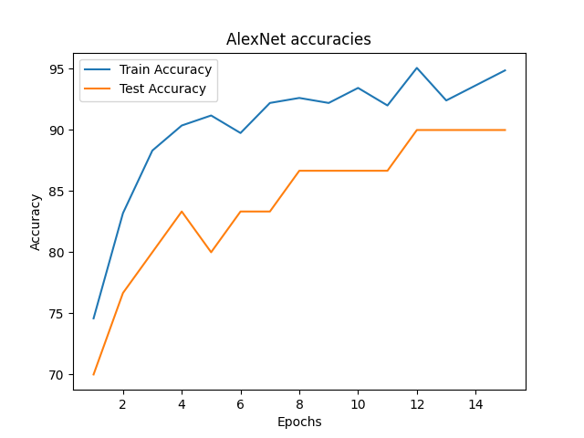
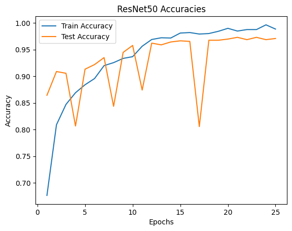

# Brain Tumor Diagnosis Using Medical Imaging

An undergraduate project to detect brain tumor using CNN focused on explainability.

## Presentations

1. [Partial results presentation](https://docs.google.com/presentation/d/e/2PACX-1vSsF6RHmjCFyb8bXN49SsbIrhe4toYNsj4rTE7TPoiFdQPHSgWHaDHgtrMBXdVi8Mdzxywc5MmUCgUh/pub?start=false&loop=false&delayms=3000)
2. [Presentation](https://docs.google.com/presentation/d/e/2PACX-1vRye0MyGr68j0ASzOy6Q5cpIbJZZIRYydxKVhqqErn5AynRjLb-vzPhzpp8o1381-gYttAWBXINjQcP/pub?start=false&loop=false&delayms=3000)

## Experiments

To run experiments, you can access:

1. AlexNet model: `src/train.py`
2. ResNet-50 model: `src/Brain Tumor Diagnosis.ipynb`

## Results

